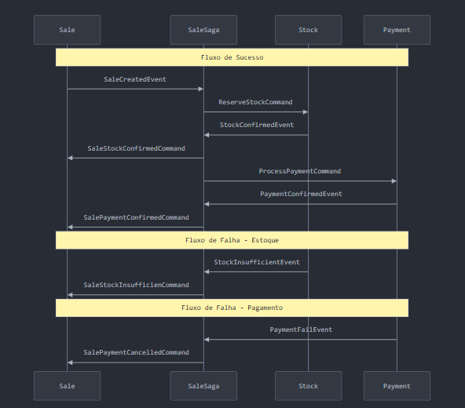

# Desafio

Criar no mesmo projeto a opção de utilizar mensageria com Rebus ou MassTransit ou NServiceBus.

# Objetivo

Este projeto tem o objetivo de demonstrar a implementação das seguintes tecnologias e padrões: 
- API (.net) 
- Patterns: DDD, EDD, CQRS
- NServiceBus usando Saga (rabbitmq)
- Redis
- Fluent
- Mediatr
- Entity
- Angular
- Postgres
- Docker
- ...

## Projeto

São 4 serviços:
- Product, cadastro simples usando redis para cache
- Stock, cadastro simples entrada de produtos no estoque
- Sale, cadastro simples de uma venda. 
    - Processo (NServiceBus Saga):
        - Envia mensagem para serviço Stock
        - Serviço Stock verifica se tem os itens no Stock
        - Se sim, envia mensagem para Sale dizendo stock ok e envia mensagem para Payment
        - Se não, envia mensagem para Sale e encerra o processo
        - Payment simula o pagamento ok ou fail, nos dois casos retorna comunicação para Sale e encerra o processo       
- Payment, simula pagamento ok ou fail e envia mensagem para Sale
- Contrução de um mini framework para implementação

## Rodar Aplicação no Docker

- build do backend, acessar a pasta src\backend\src e no terminal rodar
    - docker-compose up --build
- build do fronteend, acessar a pasta src\frontend\appclientangular e no terminal rodar
    - docker build -t app-client -f Dockerfile .
- rodar migration para gerar o banco de dados. Acessar src\backend\src\Shared\Shared.Infrasctructure e no terminal rodar
    - dotnet ef migrations add InitialCreate
    - dotnet ef database update
- rodar os containers

## Fluxo Mensagens entre Endpoints

## Trocar de mensageria

1. WebApi Sale, Stock, Payment relacionar qual mensageria deseja usar. Por exemplo:
   1.1 Se for usar MassTransit add referencia ao projeto Stock.Infrastructure.MassTransit
   1.2 Se for usar Rebus add referencia ao projeto Stock.Infrastructure.Rebus
   1.3 Se for usar NServiceBus add referencia ao projeto Stock.Infrastructure.NServiceBus
2. No appsettings.json definir qual mensageria utilizar.

TODO:
1.Criar orquestrador para definir qual mensageria utilizar sem precisar referencia ou criar workers separadado e um orquestrador que antes de rodar o projeto escolher a mensageria

## TODO

- criar IoC
- revisar projeto
- add mais consultas com signalr
- add outras tecnologias de frontend como blazor, nextjs
- NServiceBus tem problema de compatibilidade, então em alguns momento falha a mensageria verificar mais a fundo o problema. 
- A solução final seria criar workers específicos e um orquestrador para definir a mensageria e no handle de events ter projetos separados por mensageria
- Ver a possbilidade de criar Handle genércio para tratas os evens and commands.

